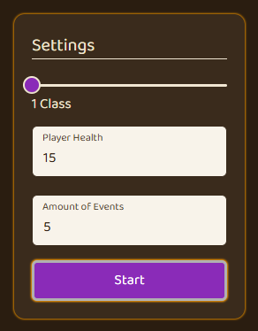
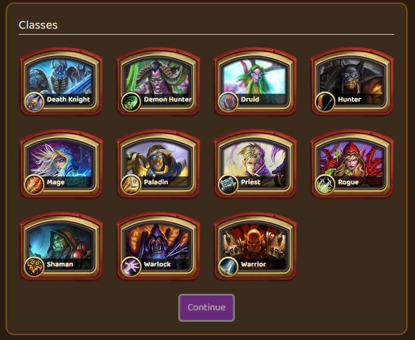
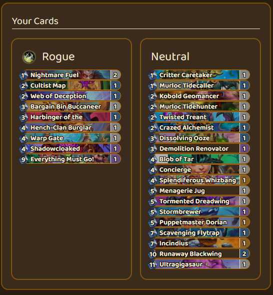
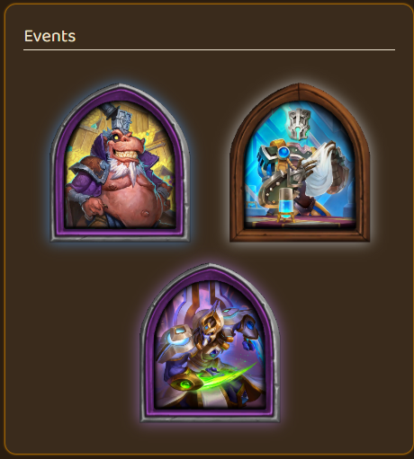
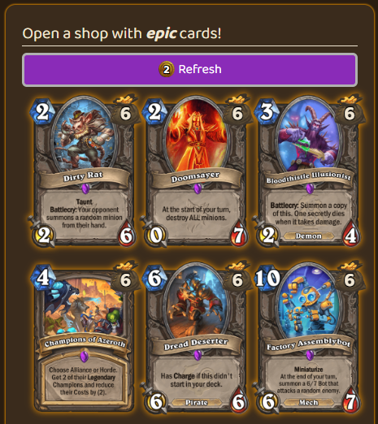
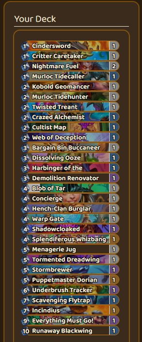
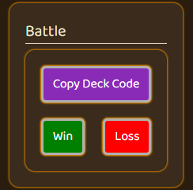
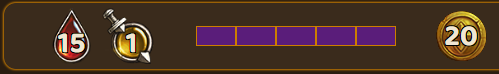

# Hearthstone Advenure Client

A **client to simulate *Hearthstone Solo Adventures***, enhanced with events, shops and asynchronous multiplayer with friends. Inspired by Hearthstone, but with custom rules and mechanics.

---

## Features

- Accessible over [browser](https://kpoptrashBlaenk.github.io/hearthstone-adventure-client/)!
- Uses **original Hearthstone cards** from the official API
- Simulates **solo adventures**
- Includes custom **shops, events, and buckets**
- Asynchronous **player duels** with a friend

---

## Screenshots

*Select the number of classes, the player health and the amount of events between each battle.*

*Choose classes in the number you selected in the previous step.*

*Get random cards to make basic decks.*

*Choose one of the following events.*

- **Shop**: Buy and sell cards. ***Cards sell for half of their buying cost!***  
- **Discover**: Choose **twice** from one of three cards.  
- **Choose**: Choose **one** of two cards.  
- **Get**: Simply get a card.  

*Buy cards for following prices:*

- **Common**: 2 Gold  
- **Rare**: 4 Gold  
- **Epic**: 6 Gold  
- **Legendary**: 8 Gold  

*Build a deck for a class to battle with.*

*Copy the deck code and battle your friend! Select then the outcome.*

- **Health**: Your current health. If your health is at 0, you lose.  
- **Attack**: The damage you take for losing. It increments every round!
- **Event**: The current event.
- **Gold**: Your gold that you use in the shop. Every round you regenerate 5 gold.

---

## Contributing

This project is **open sourcce** and welcomes contributions!

1. Fork the repository

2. Create a new branch (git checkout -b feature/your-feature)

3. Make your changes and commit (git commit -m 'Add some feature')

4. Push to the branch (git push origin feature/your-feature)

5. Open a Pull Request

Please follow the coding style used in the project and run npm run format before submitting PRs.

---

## License

This project is released under the MIT License. Please see the [licence file](LICENSE.md) for more information. [tl;dr](https://www.tldrlegal.com/license/mit-license) you can do whatever you want as long as you include the original copyright and license notice in any copy of the software/source.

---

**Note**: All Hearthstone cards and intellectual property belong to Blizzard Entertainment. This project is **fan-made** and for educational or entertainment purposes only.
